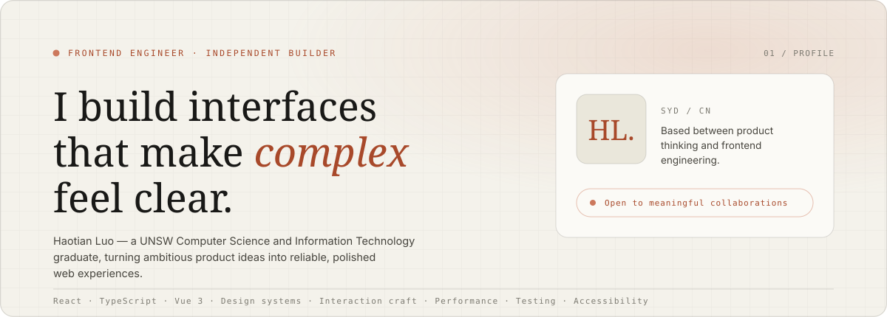

  <picture>
    <source media="(prefers-color-scheme: dark)" srcset="./assets/hero-dark.svg" />
    <source media="(prefers-color-scheme: light)" srcset="./assets/hero-light.svg" />
    
  </picture>

<h1 align="center">Haotian Luo · Hart</h1>

  <b>Frontend engineer</b> — I build interfaces that make complex feel clear.

  A UNSW Computer Science and Information Technology graduate, now focused on turning 
  ambitious product ideas into reliable, polished web experiences. 
  前端工程师 · 关注从交互到服务、从体验到工程质量的完整链路。

  <a href="https://haotian14.github.io/Portfolio/#top">Portfolio</a> ·
  <a href="mailto:luohaotian0616@gmail.com">Email</a> ·
  <a href="https://www.linkedin.com/in/hart-luo-919866392">LinkedIn</a> ·
  <a href="https://github.com/Haotian14?tab=repositories">Repositories</a>

---

## Journey

### Frontend Engineer — Product & Platform Development

Building production web experiences with React, Vue and TypeScript — from complex
interaction flows to performance, testing and release quality.

### Master of Information Technology — UNSW Sydney, 2024–2025

Machine learning and data mining, recommender systems, graph analytics, big data
management, information retrieval and web search; concepts of programming languages,
software construction tooling, security engineering and cyber security;
human–computer interaction, knowledge representation and reasoning, research methods.
Finished on a team capstone.

### Bachelor of Computer Science — UNSW Sydney, 2021–2024

C and computer systems, data structures, algorithm design and analysis, discrete
mathematics; software engineering practice, object-oriented design, database internals,
computer networks; artificial intelligence, neural networks and deep learning, computer
vision, web front-end programming. Closed with a team capstone taken from proposal to
delivery.

---

## How I work

I enjoy the part of frontend work where the answer is not simply "build the screen" —
clarifying fuzzy requirements, modelling complicated state, protecting the main user
flow, and making the final experience feel effortless.

| Think in systems | Ship with evidence | Stay close to users |
| :--- | :--- | :--- |
| Design components, state and data flow so the product can grow without becoming fragile. | Use tests, performance budgets and reproducible flows to turn confidence into something measurable. | Treat interaction polish, edge cases and clear feedback as core product work — not decoration. |

### Tools I reach for

| Interface | Craft | Platform |
| :--- | :--- | :--- |
| `React` `TypeScript` `Vue 3` `JavaScript` | `Vite` `Umi` `Ant Design` `ECharts` | `Node.js` `Spring Boot` `Docker` `GitHub Actions` |

Alongside the libraries, the parts I keep sharpening: `Design systems` `Interaction craft`
`Performance` `Testing` `Accessibility`.

---

## Selected projects

Learning by building things that are meant to be used.

### Texas Hold'em Trainer

A complete 6-max poker training loop with range-aware AI, replayable hands, EV-based
reviews and long-term leak reports. Built as an offline-first PWA with 985 automated tests.

`React` `TypeScript` `PWA` `Playwright` —
[source](https://github.com/Haotian14/Texas_Hold) ·
[live](https://texas-hold.luohaotian0616.workers.dev/)

### Frontend Interview Handbook

A structured frontend knowledge system with 50 in-depth topics, full-text search,
interview drills, code references and a dependency-based learning map. Every route is
prerendered for speed and discoverability.

`React` `TypeScript` `Vite` `MDX` —
[source](https://github.com/Haotian14/frontend-interview-notes) ·
[live](https://frontend-review-handbook.minato13.chatgpt.site/)

### Algorithm Interview Handbook

A focused interview handbook for machine learning roles: 17 chapters, 201
high-frequency review questions and runnable implementations covering LLMs,
recommender systems, computer vision, machine learning and system design.

`LLM` `Machine Learning` `Algorithms` `Static Web` —
[source](https://github.com/Haotian14/Algorithm-Review-Handbook) ·
[live](https://haotian14.github.io/Algorithm-Review-Handbook/#/)

### Portfolio

The React and TypeScript site this profile is drawn from — a warm paper palette, a
scroll-driven chapter rail, and motion that respects `prefers-reduced-motion`.

`React` `TypeScript` `Vite` `CSS` —
[source](https://github.com/Haotian14/Portfolio) ·
[live](https://haotian14.github.io/Portfolio/#top)

---

## Contribution log

  <picture>
    <source media="(prefers-color-scheme: dark)" srcset="https://raw.githubusercontent.com/Haotian14/Haotian14/output/github-snake-dark.svg" />
    <source media="(prefers-color-scheme: light)" srcset="https://raw.githubusercontent.com/Haotian14/Haotian14/output/github-snake.svg" />
    
  </picture>

Generated in this repository rather than by an action off the shelf: `scripts/contributions.mjs`
reads the calendar over the GitHub GraphQL API and `scripts/snake.mjs` plans the hunt — the snake
picks a nearby day you contributed on, roams over to it, eats it, and grows one segment longer,
with that growth paced across the whole loop. Pure CSS, so it animates inside a README, and it
holds still under `prefers-reduced-motion`. Refreshed every 12 hours.

贪吃蛇每吃掉一格贡献就长长一节，浅色深色各一版。

---

## What's next

**Still learning. Still shipping.** I'm especially interested in ambitious frontend
systems, AI-native products, and the craft of turning complex tools into interfaces
people actually enjoy using. If you're working on something along those lines, I'd like
to hear about it.

- **Email** — [luohaotian0616@gmail.com](mailto:luohaotian0616@gmail.com)
- **LinkedIn** — [linkedin.com/in/hart-luo-919866392](https://www.linkedin.com/in/hart-luo-919866392)
- **GitHub** — [github.com/Haotian14](https://github.com/Haotian14)
- **Portfolio** — [haotian14.github.io/Portfolio](https://haotian14.github.io/Portfolio/#top)
