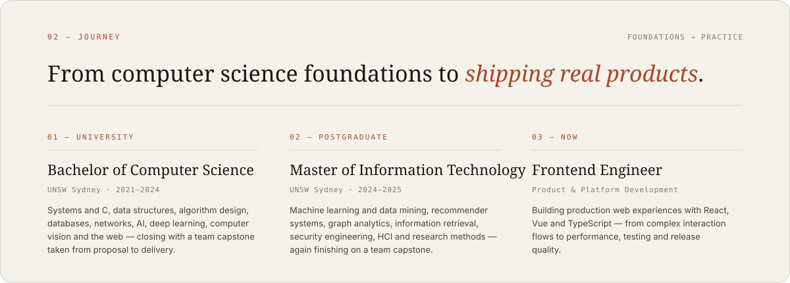
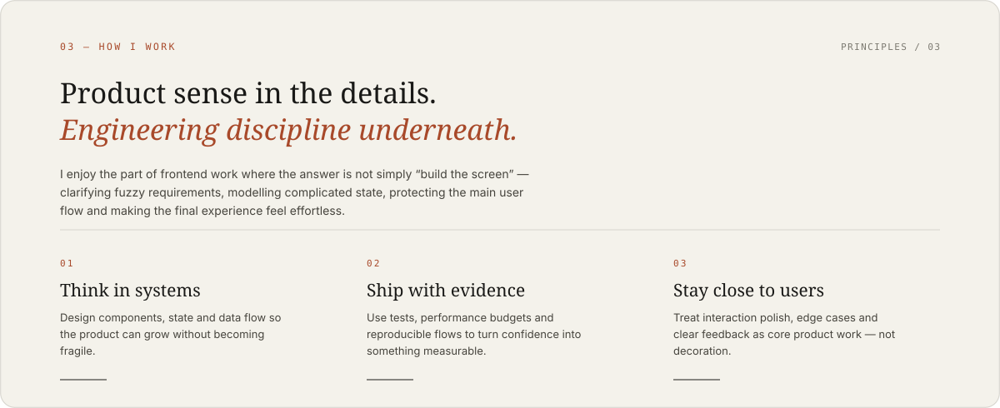
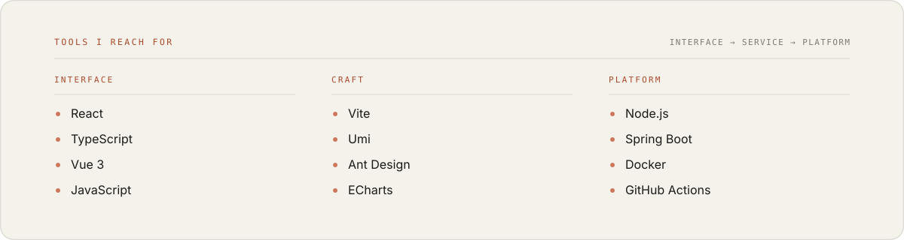
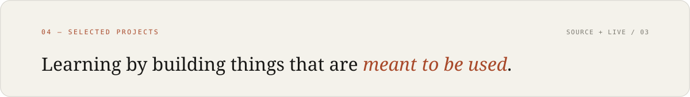
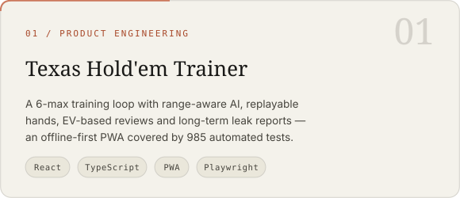
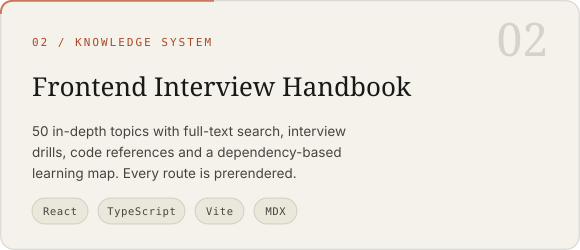
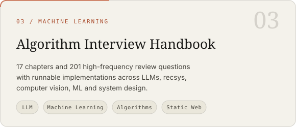
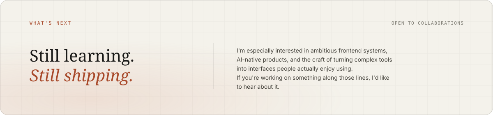

  <picture>
    <source media="(prefers-color-scheme: dark)" srcset="./assets/hero-dark.svg" />
    <source media="(prefers-color-scheme: light)" srcset="./assets/hero-light.svg" />
    
  </picture>

  <a href="https://haotian14.github.io/Portfolio/#top"><b>Portfolio</b></a>
  &nbsp;·&nbsp;
  <a href="https://haotian14.github.io/Portfolio/#journey">Journey</a>
  &nbsp;·&nbsp;
  <a href="https://haotian14.github.io/Portfolio/#work">How I work</a>
  &nbsp;·&nbsp;
  <a href="https://haotian14.github.io/Portfolio/#projects">Projects</a>
  &nbsp;·&nbsp;
  <a href="mailto:luohaotian0616@gmail.com">Contact</a>

  前端工程师 · 关注从交互到服务、从体验到工程质量的完整链路。

  <picture>
    <source media="(prefers-color-scheme: dark)" srcset="./assets/journey-dark.svg" />
    <source media="(prefers-color-scheme: light)" srcset="./assets/journey-light.svg" />
    
  </picture>

  <picture>
    <source media="(prefers-color-scheme: dark)" srcset="./assets/work-dark.svg" />
    <source media="(prefers-color-scheme: light)" srcset="./assets/work-light.svg" />
    
  </picture>

  <picture>
    <source media="(prefers-color-scheme: dark)" srcset="./assets/toolbox-dark.svg" />
    <source media="(prefers-color-scheme: light)" srcset="./assets/toolbox-light.svg" />
    
  </picture>

  <picture>
    <source media="(prefers-color-scheme: dark)" srcset="./assets/projects-dark.svg" />
    <source media="(prefers-color-scheme: light)" srcset="./assets/projects-light.svg" />
    
  </picture>

  <a href="https://texas-hold.luohaotian0616.workers.dev/">
    <picture>
      <source media="(prefers-color-scheme: dark)" srcset="./assets/project-poker-dark.svg" />
      <source media="(prefers-color-scheme: light)" srcset="./assets/project-poker-light.svg" />
      
    </picture>
  </a>
  <a href="https://frontend-review-handbook.minato13.chatgpt.site/">
    <picture>
      <source media="(prefers-color-scheme: dark)" srcset="./assets/project-frontend-dark.svg" />
      <source media="(prefers-color-scheme: light)" srcset="./assets/project-frontend-light.svg" />
      
    </picture>
  </a>

  
    <b>Texas Hold'em Trainer</b>
    <a href="https://github.com/Haotian14/Texas_Hold">source</a> ·
    <a href="https://texas-hold.luohaotian0616.workers.dev/">live</a>
    &nbsp;&nbsp;&nbsp;&nbsp;
    <b>Frontend Interview Handbook</b>
    <a href="https://github.com/Haotian14/frontend-interview-notes">source</a> ·
    <a href="https://frontend-review-handbook.minato13.chatgpt.site/">live</a>
  

  <a href="https://haotian14.github.io/Algorithm-Review-Handbook/#/">
    <picture>
      <source media="(prefers-color-scheme: dark)" srcset="./assets/project-algorithms-dark.svg" />
      <source media="(prefers-color-scheme: light)" srcset="./assets/project-algorithms-light.svg" />
      
    </picture>
  </a>

  
    <b>Algorithm Interview Handbook</b>
    <a href="https://github.com/Haotian14/Algorithm-Review-Handbook">source</a> ·
    <a href="https://haotian14.github.io/Algorithm-Review-Handbook/#/">live</a>
  

  MORE / 其他 &nbsp;·&nbsp;
  <a href="https://github.com/Haotian14/Portfolio">Portfolio</a>
  — the React and TypeScript site this profile is designed from &nbsp;·&nbsp;
  <a href="https://github.com/Haotian14?tab=repositories">All repositories</a>
  — earlier work across full-stack, distributed systems and machine learning.

  <picture>
    <source media="(prefers-color-scheme: dark)" srcset="https://raw.githubusercontent.com/Haotian14/Haotian14/output/github-snake-dark.svg" />
    <source media="(prefers-color-scheme: light)" srcset="https://raw.githubusercontent.com/Haotian14/Haotian14/output/github-snake.svg" />
    
  </picture>

  贪吃蛇每吃掉一格贡献就长长一节 · built in this repo, refreshed every 12 hours.

  <picture>
    <source media="(prefers-color-scheme: dark)" srcset="./assets/closing-dark.svg" />
    <source media="(prefers-color-scheme: light)" srcset="./assets/closing-light.svg" />
    
  </picture>

  <a href="mailto:luohaotian0616@gmail.com">Email</a>
  &nbsp;·&nbsp;
  <a href="https://www.linkedin.com/in/hart-luo-919866392">LinkedIn</a>
  &nbsp;·&nbsp;
  <a href="https://github.com/Haotian14">GitHub</a>
  &nbsp;·&nbsp;
  <a href="https://haotian14.github.io/Portfolio/#top">haotian14.github.io/Portfolio</a>

