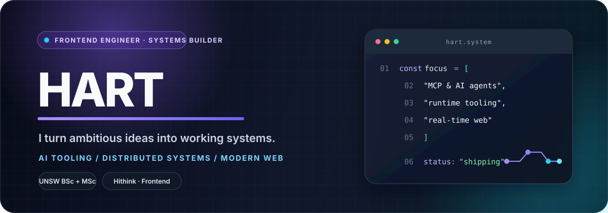
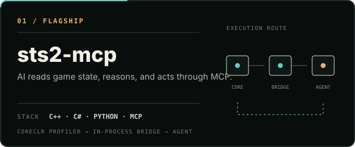
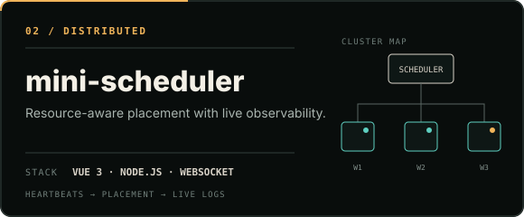
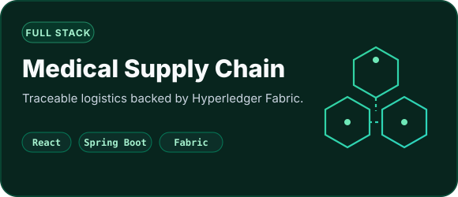
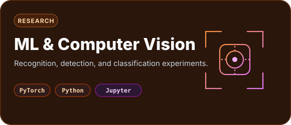
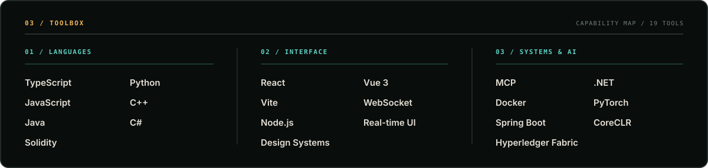

  

  <a href="https://github.com/Haotian14">GitHub</a>
  &nbsp;·&nbsp;
  <a href="mailto:luohaotian0616@gmail.com">Email</a>
  &nbsp;·&nbsp;
  <a href="https://github.com/Haotian14?tab=repositories">Projects</a>

  <b>你好，我是 Hart。</b>我喜欢把大胆的想法做成真正能运行的系统。 
  Frontend engineer by profession; systems builder by curiosity.

<table>
  <tr>
    <td align="center" width="33%">
      NOW / 现在 
      <b>Frontend Engineer</b> 
      Hithink · 同花顺
    </td>
    <td align="center" width="33%">
      EDUCATION / 教育 
      <b>Computer Science</b> 
      UNSW · BSc + MSc
    </td>
    <td align="center" width="33%">
      EXPLORING / 探索 
      <b>AI × Systems</b> 
      MCP · Runtime · Real-time Web
    </td>
  </tr>
</table>

 

<h2 align="center">Selected work / 精选项目</h2>

  Not just demos — projects that cross layers, solve real engineering problems, and keep teaching me something new. 
  不只做界面，也深入后端、运行时、工具链与 AI Agent，把完整链路真正跑通。

<table>
  <tr>
    <td width="50%" valign="top">
      
       
      C++ CoreCLR Profiler → in-process C# bridge → Python MCP server. AI can read game state, execute actions, and work toward autonomous play.
    </td>
    <td width="50%" valign="top">
      
       
      Resource-aware task placement, worker heartbeats, live logs, and a Vue 3 operations dashboard connected through WebSocket.
    </td>
  </tr>
  <tr>
    <td width="50%" valign="top">
      
       
      A traceable medical logistics platform built with React, Spring Boot, and Hyperledger Fabric. I owned frontend development.
    </td>
    <td width="50%" valign="top">
      
       
      Gesture recognition, object detection, and classification experiments. Also see <a href="https://github.com/Haotian14/Cmputer-Vision">Computer Vision</a>.
    </td>
  </tr>
</table>

  <a href="https://github.com/Haotian14/frontend-interview-notes"><b>Frontend Interview Notes</b></a>
  — structured JavaScript, TypeScript, React, browser, and engineering notes. 
  系统整理前端基础、手写实现与工程实践，把“理解”转化为“能清楚讲出来”。

 

<h2 align="center">How I build / 我的技术版图</h2>

  I care about the whole path: <b>interface → service → runtime → automation</b>. 
  我关心的不只是某个框架，而是产品从交互、服务到系统运行的完整路径。

  

 

<h2 align="center">Contribution trail / 贡献轨迹</h2>

  A living contribution map in the same violet → cyan palette as this profile. 
  用紫罗兰到青色的轨迹，记录每一次持续构建。

  <picture>
    <source media="(prefers-color-scheme: dark)" srcset="https://raw.githubusercontent.com/Haotian14/Haotian14/output/github-snake-dark.svg" />
    <source media="(prefers-color-scheme: light)" srcset="https://raw.githubusercontent.com/Haotian14/Haotian14/output/github-snake.svg" />
    
  </picture>

  Good software is equal parts craft, curiosity, and persistence. 
  <b>持续构建，持续学习。</b>

